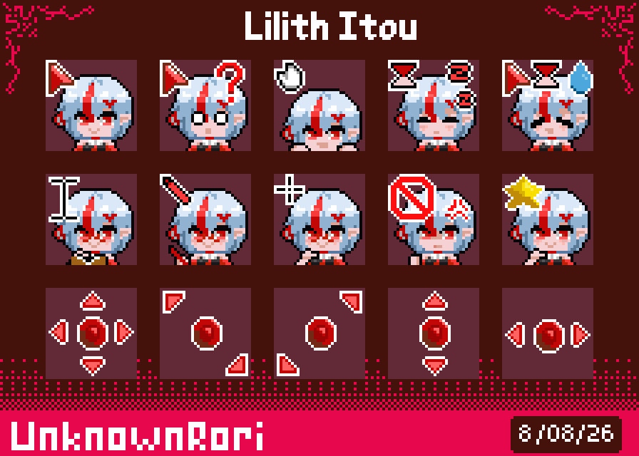

# Rori Cursor Maker

This project born because I want to streamlined my cursor generation from a png files,
before that I been using a Makefile and shell script, and I still find it annoying
to work with. So because of that problem I decided to make a C project that help
me making this much simpler.

For now this project is not fully open-sourced as I using my own custom library
for creating the cursor (In C of course), the reason for me not to fully open-source is
from my life circumstance, feel free to deduce why.

Go visit my [Ko-fi](https://ko-fi.com/unknownrori) page for cursor stuff

## Demo

## Feature

- Automatic project creation
- Batching build and fast
- Automatic scaling
- Pre-configured offset based on my cursor making style
- Cross-platform without any OS specific except for standard I/O operation
- Built a .exe to streamline user installation

## Special Mention

Thanks to tsoding for providing amazing single-header file of `nob`.

## LICENSE

MIT
